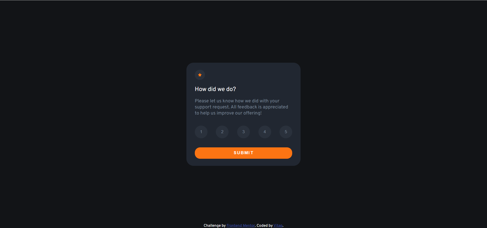
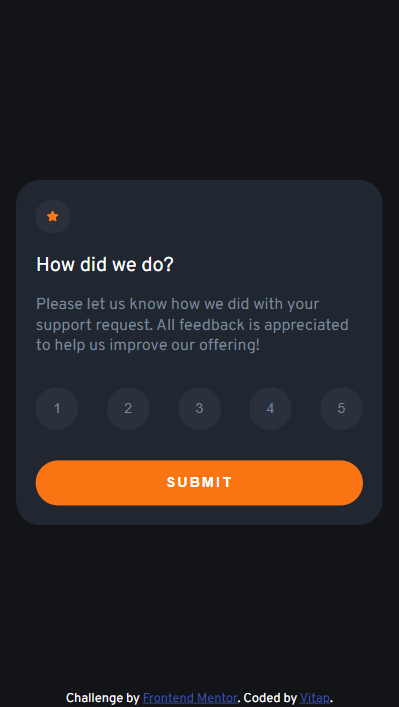

# Frontend Mentor - Interactive rating component solution

This is a solution to the [Interactive rating component challenge on Frontend Mentor](https://www.frontendmentor.io/challenges/interactive-rating-component-koxpeBUmI). Frontend Mentor challenges help you improve your coding skills by building realistic projects.

## Table of contents

- [Frontend Mentor - Interactive rating component solution](#frontend-mentor---interactive-rating-component-solution)
  - [Table of contents](#table-of-contents)
  - [Overview](#overview)
    - [The challenge](#the-challenge)
    - [Screenshot](#screenshot)
    - [Links](#links)
  - [My process](#my-process)
    - [Built with](#built-with)
    - [What I learned](#what-i-learned)
    - [Continued development](#continued-development)
    - [Useful resources](#useful-resources)
  - [Author](#author)

## Overview

### The challenge

Users should be able to:

- View the optimal layout for the app depending on their device's screen size
- See hover states for all interactive elements on the page
- Select and submit a number rating
- See the "Thank you" card state after submitting a rating

### Screenshot

<figure align="center">
  
  <figcaption>
    <b>Fig.1 - Desktop Screenshot</b>
  </figcaption>
</figure>

<figure align="center">
  
  <figcaption>
    <b>Fig.2 - Mobile Screenshot</b>
  </figcaption>
</figure>

### Links

- Solution URL: [Add solution URL here](https://your-solution-url.com)
- Live Site URL: [interactive-rating-component-main](https://interactive-rating-component-main-cgtf9dj1z-vitap7.vercel.app/)

## My process

### Built with

- Semantic HTML5 markup
- CSS custom properties
- Flexbox
- Sass

### What I learned

```html
<script src="./index.js" async></script>
```

```html

```

```css
/* in Sass */
@media (min-width: $mobile-width) {
  @media (max-width: $desktop-width) {
    padding: 1em 0;
    border-radius: 1.75em;
  }
}
```

```js
const handleRate = (e) => {
  if (rating === e.target.dataset.level) {
    e.target.classList.remove("selected");
  } else {
    levelBtns.forEach((button) => {
      button.classList.remove("selected");
    });
    rating = e.target.dataset.level;
    e.target.classList.add("selected");
  }
};
```

### Continued development

- Lear more about CSS Transitions

### Useful resources

- [CSS At-Rules in Sass](https://sass-lang.com/documentation/at-rules/css) - This helped me for demonstrate the way to use @media in Sass.
- [Using querySelectorAll to retrieve direct children](https://stackoverflow.com/a/66177817) - This is an amazing article which helped me learn about multiple ways to query the specific elements. I'd recommend it to anyone still learning this concept.

## Author

- Github - [Vitap](https://github.com/Vitap7)
- Frontend Mentor - [@Vitap7](https://www.frontendmentor.io/profile/Vitap7)
